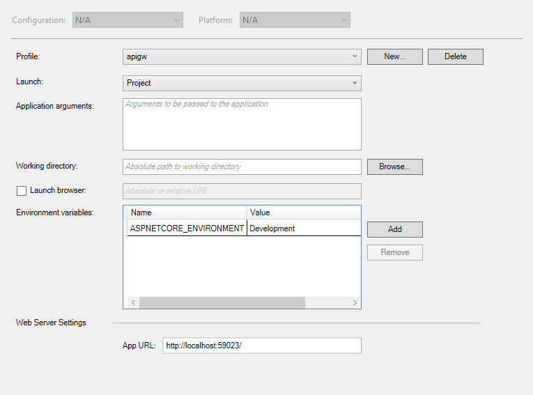

# What this example is about?

This is demo project for [RabbitMQ.TraceableMessaging](https://github.com/dmlarionov/RabbitMQ.TraceableMessaging) with Application Insights.

It shows how communications between microservices can be built over RabbitMQ with distributed traceability. You can benefit from scrutinizing this project if you:

1. Need example of what Application Insights distributed traces can be.
2. Need example for drilling down from unsuccessful entry point (API gateway) request through backend microservice dependency calls to learn finding out request failure root causes.
3. Learn how to implement microservices over message bus with [RabbitMQ.TraceableMessaging](https://github.com/dmlarionov/RabbitMQ.TraceableMessaging).

# Preparation

## Create Application Insights

You need Azure with Application Insights instance. If you don't have Azure by now, start from https://azure.microsoft.com/free/. In Azure, please, create App Insights and find instrumentation key there:


## Install .NET Core SDK

You need .NET Core SDK 2.2. Download it from [here](https://dotnet.microsoft.com/download/dotnet-core/2.2) then install or check if you have it:

```
dotnet --list-sdks
```

## Install Docker

Probably, you'll prefer to use docker to start RabbitMQ instance. Otherwise, you can use RabbitMQ service installed anywhere by configuring application settings (`appsettings.json`) for each microservice (`bang`, `bar`, `fib`, `foo`), API gateway (`apigw`) and CLI (`cli`) with appropriate credentials, but all they are already tested with default settings and default `rabbitmq` docker image.

Go to [Docker Desktop](https://www.docker.com/products/docker-desktop) then install it or check if you have docker and compose:

```
docker version
docker-compose version
```

## Install VS Code or Visual Studio

Neither is required, use an approach to build and run that is convenient for you. So below are described three of them - one based on VS Code, another on Visual Studio and last one is everything in Docker way (except CLI which is the client).

## Clone repository

Clone `RabbitMQ.TraceableMessaging-example1` wherever you prefer:

```
git clone https://github.com/dmlarionov/RabbitMQ.TraceableMessaging-example1.git <...>
```

# Build and run

## Approach 1 (Visual Studio Code)

1. Start RabbitMQ:

```
docker-compose -f .\docker-compose.rabbitmq.yml up
```

2. Run Visual Studio Code and open the repository folder.
3. Build by pressing `Ctrl` + `B` then choose `build` task.
4. On debug pane launch `RUN ALL` compound. CLI will be opened in external terminal.
5. Paste App Insights instrumentation key into CLI.
6. Play with scenarios.
7. Press `q` to quit then stop debug in VS Code (`Shift` + `F5` six times).
8. Stop docker-compose (`Ctrl` + `C` in its terminal window).
9. Wait five minutes then scrutinize results in Application Insights instance at Azure portal.

// FIXME: ensure that `apigw` run on http://localhost:59023.

## Approach 2 (Visual Studio)

1. Start RabbitMQ:

```
docker-compose -f .\docker-compose.rabbitmq.yml up
```

2. Run Visual Studio and open solution in the repository folder. Solution should be configured for multiple startup projects - `apigw`, `bang`, `bar`, `cli`, `fib`, `foo`, but not `lib`. So check solution properties:


3. You have to start `apigw` on HTTP port that `cli` will access to. In `appsetting.json` of `cli` there are `ApiGW:Url` parameter that configured to http://localhost:59023. So check `apigw` web server settings:



4. Build solution.
5. Start then find CLI terminal window.
6. Paste App Insights instrumentation key into CLI.
7. Play with scenarios.
8. Press `q` to quit then stop debug in Visual Studio (`Shift` + `F5`).
9. Stop docker-compose (`Ctrl` + `C` in its terminal window).
10. Wait five minutes then scrutinize results in Application Insights instance at Azure portal.

## Approach 3 (Everything in Docker)

1. Start everything except CLI in Docker:

```
docker-compose up
```

2. Start CLI:

```
dotnet run -p .\cli\
```

3. Paste App Insights instrumentation key into CLI.
4. Play with scenarios.
5. Press `q` to quit CLI.
6. Stop docker-compose (`Ctrl` + `C` in its terminal window).
7. Wait five minutes then scrutinize results in Application Insights instance at Azure portal.

// FIXME: add resilience to all projects for RabbitMQ unavailability at startup.

# Playing with scenarios


# Scrutinizing Application Insights

