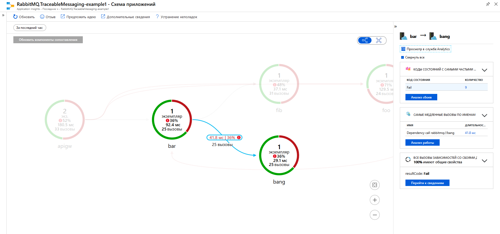
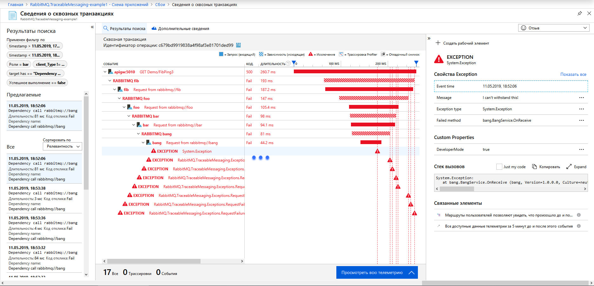
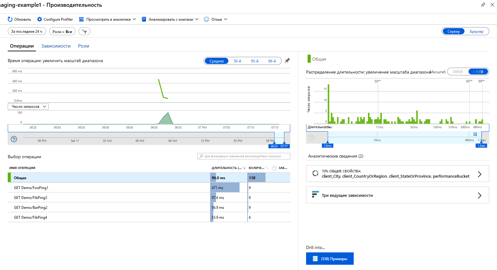

# What this example is about?

This is demo project for [RabbitMQ.TraceableMessaging](https://github.com/dmlarionov/RabbitMQ.TraceableMessaging) with Application Insights.

It shows how communications between microservices can be built over RabbitMQ with distributed traceability. You can benefit from scrutinizing this project if you:

1. Need example of what Application Insights distributed traces can be.
2. Need example for drilling down from unsuccessful entry point (API gateway) request through backend microservice dependency calls to learn finding out request failure root causes.
3. Learn how to implement microservices over message bus with [RabbitMQ.TraceableMessaging](https://github.com/dmlarionov/RabbitMQ.TraceableMessaging).

# Preparation

## Create Application Insights

You need Azure with Application Insights instance. If you don't have Azure by now, start from https://azure.microsoft.com/free/. In Azure, please, create App Insights and find instrumentation key there:


## Install Docker

Probably, you'll prefer to use Docker to start everything or at least RabbitMQ. Go to [Docker Desktop](https://www.docker.com/products/docker-desktop) then install it or check if you have docker and compose:

```
docker version
docker-compose version
```
I have tested with Docker Engine - Community 18.09.2 and docker-compose version 1.23.2. I believe higher versions should support the same instructions.

## Install .NET Core SDK (optional)

If you like to start in VS Code or Visual Studio then you need .NET Core SDK 2.2. Download it from [here](https://dotnet.microsoft.com/download/dotnet-core/2.2) then install or check if you have it:

```
dotnet --list-sdks
```

It's not necessary to have .NET Core SDK or VS Code / VS, you may just `docker-compose run cli`, but you may like to debug with it.

## Install VS Code or Visual Studio (optional)

Neither is required, use an approach to build and run that is convenient for you. So below three of them are described - everything in Docker, approach based on VS Code, another on Visual Studio.

## Clone repository

```
git clone https://github.com/dmlarionov/RabbitMQ.TraceableMessaging-example1.git
```

# Build and run

## Approach 1 (Everything in Docker)

1. Start everything and attach to CLI:

```
docker-compose run cli
```

2. Paste App Insights instrumentation key into CLI.
3. Play with scenarios.
4. Quit CLI with `q` to force telemetry flushing to the cloud.
5. Press `Ctrl`+`C` to stop `cli` container.
6. Stop everything else:

```
docker-compose down
```

6. Wait few minutes then scrutinize results in Application Insights instance at Azure portal.

## Approach 2 (Visual Studio Code)

1. Start RabbitMQ:

```
docker-compose -f .\docker-compose.rabbitmq.yml up -d
```

2. Run Visual Studio Code and open the repository folder.
3. Build by pressing `Ctrl` + `Shift` +  `B` then choose `build` task.
4. On debug pane launch `RUN ALL` compound. CLI will be opened in external terminal.
5. Paste App Insights instrumentation key into CLI.
6. Play with scenarios.
7. Quit CLI with `q` to force telemetry flushing to the cloud.
8. Stop debug in VS Code (`Shift` + `F5` six times).
9. Stop docker-compose with RabbitMQ:

```
docker-compose down
```

10. Wait few minutes then scrutinize results in Application Insights instance at Azure portal.

## Approach 3 (Visual Studio)

1. Start RabbitMQ:

```
docker-compose -f .\docker-compose.rabbitmq.yml up -d
```

2. Run Visual Studio and open solution in the repository folder. Solution should be configured for multiple startup projects - `apigw`, `bang`, `bar`, `cli`, `fib`, `foo`, but not `lib`. So check solution properties:


3. Build solution.
4. Run and find CLI terminal window.
5. Paste App Insights instrumentation key into CLI.
6. Play with scenarios.
7. Quit CLI with `q` to force telemetry flushing to the cloud.
8. Stop debug in Visual Studio (`Shift` + `F5`).
9. Stop docker-compose with RabbitMQ:

```
docker-compose down
```

10. Wait few minutes then scrutinize results in Application Insights instance at Azure portal.

# Playing with scenarios

After you enter Application Insights instrumentation key, CLI sends it to every microservice and to API gateway, awaits for ready message from all of them, then (if ok) displays the following menu:

```
Which scenario should we test with API gateway?:
1) HTTP GET /api/demo/fooping1
2) HTTP GET /api/demo/barping2
3) HTTP GET /api/demo/fibping3 (Internal Server Error)
4) HTTP GET /api/demo/fibping4 (Forbidden)

Each HTTP call to API gateway turnes into series of RabbitMQ calls. You can see a distributed trace in your Application Insights instance in Azure portal. You can test scenarios in any order.

To quit press 'q'.
```

You can execute scenarios in any order multiple times. After each execution the same menu will be presented to you.

# What would be happening?

CLI communicates with API gateway over HTTP. API gateway communicates with microservices (`foo`, `bar` and `fib`) over RabbitMQ. The provided scenarios (1-4) implement the following call chains:

1. CLI -> API gateway -> `foo` -> `bar`, then `bar` calls `bang` and `fib` consequently.
2. CLI -> API gateway -> `bar`, then `bar` calls `fib` and `bang` in parallel.
3. CLI -> API gateway -> `fib` -> `bar` -> `bang`, then `bang` generates `Exception`.
4. CLI -> API gateway -> `fib` -> `foo`, then `foo` generates `NotImplementedException`.

If any service at any level replies with `Unauthorized` or `Forbidden` or `Fail` status then such reply is retransmitted upstream. At the API gateway this become translated to appropriate HTTP reply:

- Status `Unauthorized` ->  HTTP `401 Unauthorized`.
- Status `Forbidden` -> HTTP `403 Forbidden`.
- Status `Fail` -> HTTP `500 Internal Server Error`.

After `401 Unauthorized` CLI asks for username, generates JWT and starts using it as bearer token with every new request. API gateway, `foo`, `bar` and `fib` retransmit token downstream over RabbitMQ.

So you will be asked for username after your first request. If you start with scenarios 2-4 then API gateway will not execute any subsequent requests for your first call, because endpoints 2-4 are protected with `[Authorize]` attribute, but if you start with scenario 1, `foo` will be called and reply retransmission used.

# How the code is organized?

Below is short explanation of essential things about the code of API gateway and microservices. Real application can be built with similar approach.

## API Gateway

RabbitMQ RPC client of [RabbitMQ.TraceableMessaging](https://github.com/dmlarionov/RabbitMQ.TraceableMessaging) library throw exceptions for `Unauthorized`, `Forbidden` and `Fail` reply status codes. This way unsuccessful replies become exceptions for further translation higher in the stack.

In API gateway there is `ExceptionFilter` which translates exceptions to HTTP reply statuses (see `apigw/ExceptionFilter.cs`):

```csharp
public void OnException(ExceptionContext context)
{
    if (context.Exception.GetType() == typeof(UnauthorizedException))
        context.Result = new UnauthorizedResult();
    else if (context.Exception.GetType() == typeof(ForbiddenException))
        context.Result = new ForbidResult();
    else
        context.Result = new StatusCodeResult(500);
}
```

HTTP controllers are extremely simple:

```csharp
public async Task<IActionResult> FooPing1() =>
    Ok(await _fooClient.GetReplyAsync<Pong1>(new Ping1(),
        HttpContext.GetTokenAsync("access_token").Result));
```

## RabbitMQ microservices

In the shared project `lib` there are `Service` class which implements `IHostedService`, declares request queue, initializes channel and `RpcServer<JwtSecurityContext>` (of [RabbitMQ.TraceableMessaging](https://github.com/dmlarionov/RabbitMQ.TraceableMessaging)), has abstract `OnReceive` method for invocation on request. See `lib/Service.cs`.

Each microservice has service class inheriting from `lib.Service` with `OnReceive` similar to this:

```csharp
protected override void OnReceive(object sender, RequestEventArgs<TelemetryContext, JwtSecurityContext> ea)
{
    try
    {
        // processing depends on request type
        switch (ea.RequestType)
        {
            case nameof(Ping1):
                ... // perfoming job for request of type Ping1
                Server.Reply(ea.CorrelationId, ...);
                break;

            case nameof(Ping3):
                ... // perfoming job for request of type Ping3
                Server.Reply(ea.CorrelationId, ...);
                break;

            default:
                throw new NotImplementedException($"{ea.RequestType} is not implemented");
        }
    }
    catch(Exception ex)
    {
        Server.Fail(ea, ex);
    }
}
```

If some microservice is a client for another microservice it declares response queue and initializes `RpcClient` for calling this downstream microservice. Such microservice's service class looks like:

```csharp
public sealed class FooService : Service
{
    private readonly RpcClient _barClient;

    public FooService(
        IConnection conn,
        IConfiguration config,
        SecurityOptions securityOptions)
            : base(conn, config, securityOptions)
    {
        var channel = conn.CreateModel();
        var queue = $"foo-bar-reply-{Guid.NewGuid().ToString()}";
        channel.QueueDeclare(queue);
        _barClient = new RpcClient(
            channel,
            new PublishOptions(config["RabbitMQ:Services:Bar"]),
            new ConsumeOptions(queue),
            new JsonFormatOptions());
    }
    
    protected override void OnReceive(object sender, RequestEventArgs<TelemetryContext, JwtSecurityContext> ea)
    {
        // you saw example above
    }
}
```

# Scrutinizing Application Insights

After short period of time, when all statistics sent to Application Insights will be processed, at application map you may see something similar to this:


I hope in real app you will have less red. If you switch to hierarchical map it will look like:


By clicking on selected call path you can see failure codes for it:



By drilling down to failure code you can investigate individual failure.



Similar to failures you can investigate performance issues:



Scrutinize Application Insights yourself to figure out how it can help you.