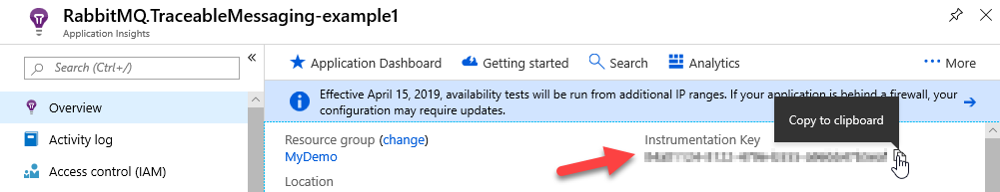
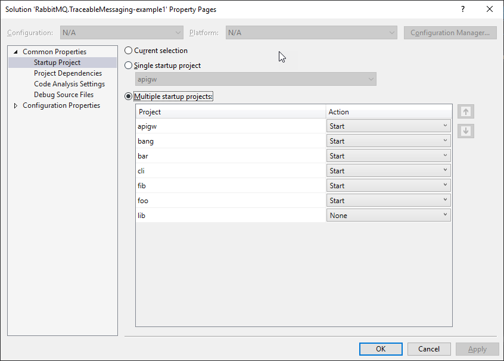
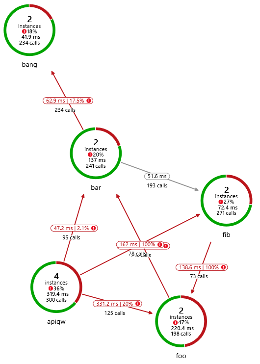
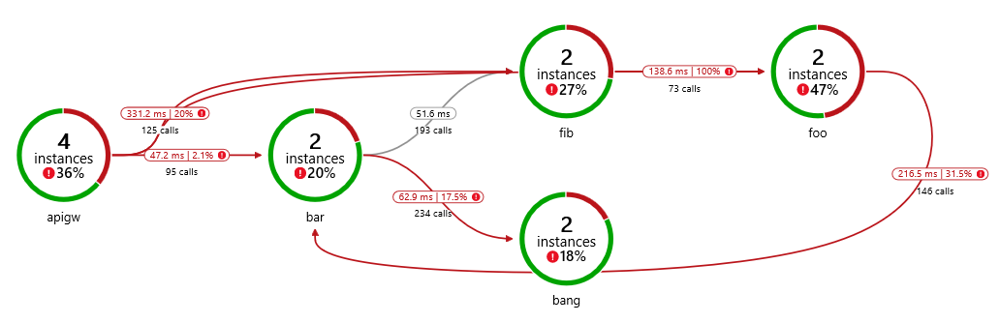
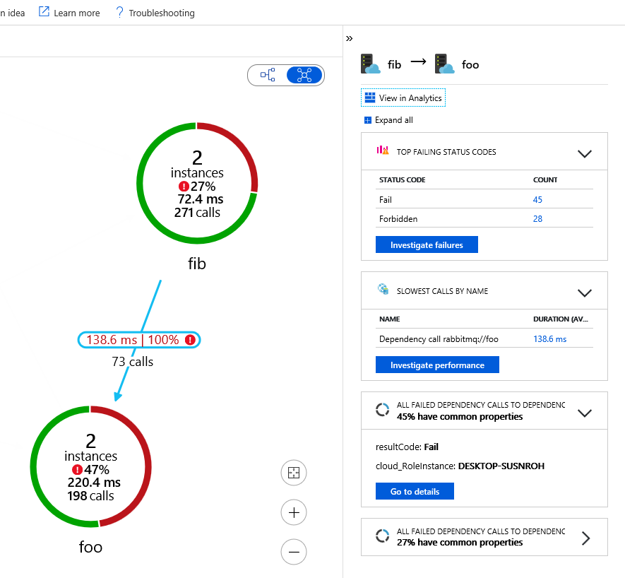
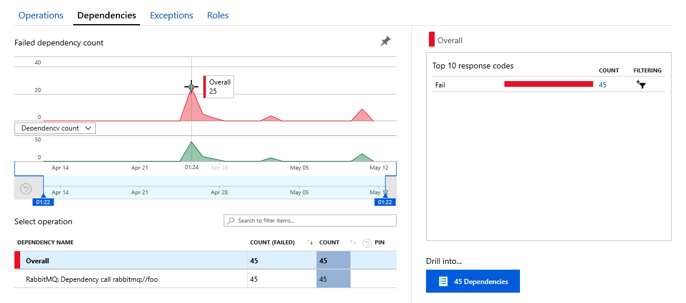
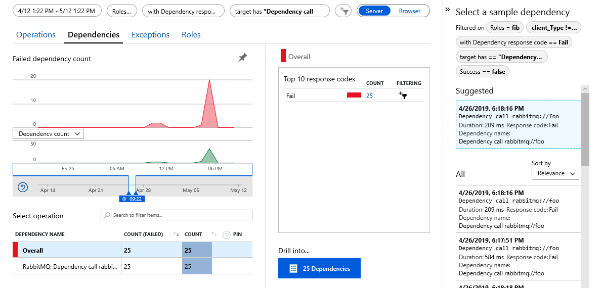
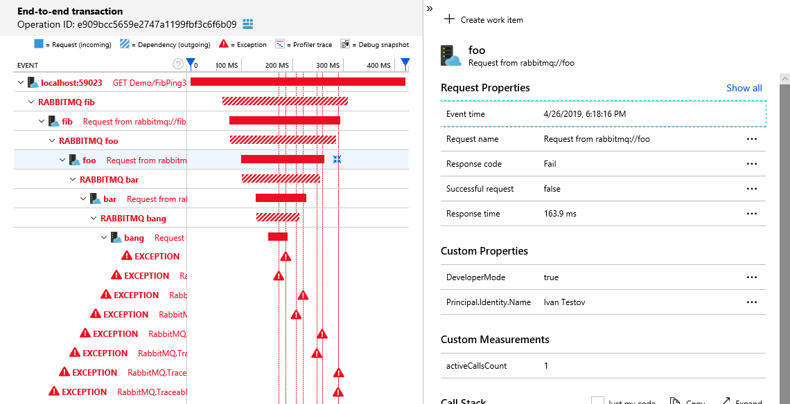
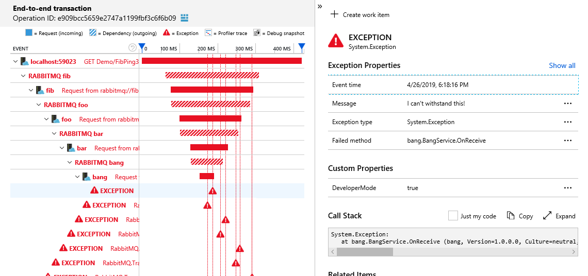

# What this example is about?

This is demo project for [RabbitMQ.TraceableMessaging](https://github.com/dmlarionov/RabbitMQ.TraceableMessaging) with Application Insights.

It shows how communications between microservices can be built over RabbitMQ with distributed traceability. You can benefit from scrutinizing this project if you:

1. Need example of what distributed tracing is.
2. Need example for drilling down from unsuccessful entry point (API gateway) request through backend microservice dependency calls to find out request failure root cause and figuring out how distributed tracing can benefit for you.
3. Learn how to implement microservices over message bus with [RabbitMQ.TraceableMessaging](https://github.com/dmlarionov/RabbitMQ.TraceableMessaging).

You don't need to know C# to reach first 2 goals.

# Preparation

## Create Application Insights

You need Azure with Application Insights instance. If you don't have Azure by now, start from https://azure.microsoft.com/free/. In Azure, please, create App Insights and find instrumentation key there:



## Install Docker

Probably, you'll prefer to use Docker to start everything or at least RabbitMQ. Go to [Docker Desktop](https://www.docker.com/products/docker-desktop) then install it or check if you have docker and compose:

```
docker version
docker-compose version
```
I have tested with Docker Engine - Community 18.09.2 and docker-compose version 1.23.2. I believe higher versions should support the same instructions.

## Install .NET Core SDK (optional)

If you like to start in VS Code or Visual Studio then you need .NET Core SDK 2.2. Download it from [here](https://dotnet.microsoft.com/download/dotnet-core/2.2) then install or check if you have it:

```
dotnet --list-sdks
```

It's not necessary to have .NET Core SDK or VS Code / VS, you may just `docker-compose run cli`, but you may like to debug with it.

## Install VS Code or Visual Studio (optional)

Neither is required, use an approach to build and run that is convenient for you. So below three of them are described - everything in Docker, approach based on VS Code, another on Visual Studio.

## Clone repository

```
git clone https://github.com/dmlarionov/RabbitMQ.TraceableMessaging-example1.git
```

# Build and run

## Approach 1 (Everything in Docker)

1. Start everything and attach to CLI:

```
docker-compose run cli
```

2. Paste App Insights instrumentation key into CLI.
3. Play with scenarios.
4. Quit CLI with `q` to force telemetry flushing to the cloud.
5. Press `Ctrl`+`C` to stop `cli` container.
6. Stop everything else:

```
docker-compose down
```

6. Wait few minutes then scrutinize results in Application Insights instance at Azure portal.

## Approach 2 (Visual Studio Code)

1. Start RabbitMQ:

```
docker-compose -f .\docker-compose.rabbitmq.yml up -d
```

2. Run Visual Studio Code and open the repository folder.
3. Build by pressing `Ctrl` + `Shift` +  `B` then choose `build` task.
4. On debug pane launch `RUN ALL` compound. CLI will be opened in external terminal.
5. Paste App Insights instrumentation key into CLI.
6. Play with scenarios.
7. Quit CLI with `q` to force telemetry flushing to the cloud.
8. Stop debug in VS Code (`Shift` + `F5` six times).
9. Stop docker-compose with RabbitMQ:

```
docker-compose down
```

10. Wait few minutes then scrutinize results in Application Insights instance at Azure portal.

## Approach 3 (Visual Studio)

1. Start RabbitMQ:

```
docker-compose -f .\docker-compose.rabbitmq.yml up -d
```

2. Run Visual Studio and open solution in the repository folder. Solution should be configured for multiple startup projects - `apigw`, `bang`, `bar`, `cli`, `fib`, `foo`, but not `lib`. So check solution properties:



3. Build solution.
4. Run and find CLI terminal window.
5. Paste App Insights instrumentation key into CLI.
6. Play with scenarios.
7. Quit CLI with `q` to force telemetry flushing to the cloud.
8. Stop debug in Visual Studio (`Shift` + `F5`).
9. Stop docker-compose with RabbitMQ:

```
docker-compose down
```

10. Wait few minutes then scrutinize results in Application Insights instance at Azure portal.

# Playing with scenarios

After you enter Application Insights instrumentation key CLI sends it to every microservice and to API gateway, awaits for ready message from all of them, then (if ok) displays the following menu:

```
Which scenario should we test with API gateway?:
1) HTTP GET /api/demo/fooping1
2) HTTP GET /api/demo/barping2
3) HTTP GET /api/demo/fibping3 (Internal Server Error)
4) HTTP GET /api/demo/fibping4 (Forbidden)

Each HTTP call to API gateway turnes into series of RabbitMQ calls. You can see a distributed trace in your Application Insights instance in Azure portal. You can test scenarios in any order.

To quit press 'q'.
```

You can execute scenarios in any order multiple times. After each execution the same menu will be presented to you.

# What would be happening?

CLI communicates with API gateway over HTTP. API gateway communicates with microservices (`foo`, `bar` and `fib`) over RabbitMQ. The provided scenarios implement the following call chains:

1. CLI -> API gateway -> `foo` -> `bar`, then `bar` calls `bang` and `fib` consequently.
2. CLI -> API gateway -> `bar`, then `bar` calls `fib` and `bang` in parallel.
3. CLI -> API gateway -> `fib` -> `bar` -> `bang`, then `bang` generates `Exception`.
4. CLI -> API gateway -> `fib` -> `foo`, then `foo` generates `NotImplementedException`.

If any service at any level replies with `Unauthorized` or `Forbidden` or `Fail` status then such reply is retransmitted upstream. At the API gateway this become translated to appropriate HTTP reply:

- RabbitMQ RPC status `Unauthorized` ->  HTTP status `401 Unauthorized`.
- RabbitMQ RPC status `Forbidden` -> HTTP status `403 Forbidden`.
- RabbitMQ RPC status `Fail` -> HTTP status `500 Internal Server Error`.

After `401 Unauthorized` CLI asks for username, generates JWT and starts using it as bearer token with every new request. API gateway, `foo`, `bar` and `fib` retransmit token downstream over RabbitMQ.

So you will be asked for username after your first request. If you start with scenarios 2-4 then API gateway will not execute any subsequent requests for your first call, because endpoints 2-4 are protected with `[Authorize]` attribute, but if you start with scenario 1, `foo` will be called without bearer token.

# How the code is organized?

Here is short explanation of essential things about the code of API gateway and microservices. Real applications can be built with similar approach. You have to know C# to understand this part.

If you just want to see what distributed traces looks like go to [Scrutinizing Application Insights](#Scrutinizing-Application-Insights).

## API Gateway

RabbitMQ RPC client of [RabbitMQ.TraceableMessaging](https://github.com/dmlarionov/RabbitMQ.TraceableMessaging) library throw exceptions for `Unauthorized`, `Forbidden` and `Fail` reply status codes. This way unsuccessful replies become exceptions for further translation higher in the stack.

In API gateway there is `ExceptionFilter` which translates exceptions to HTTP reply statuses (see `apigw/ExceptionFilter.cs`):

```csharp
public void OnException(ExceptionContext context)
{
    if (context.Exception.GetType() == typeof(UnauthorizedException))
        context.Result = new UnauthorizedResult();
    else if (context.Exception.GetType() == typeof(ForbiddenException))
        context.Result = new ForbidResult();
    else
        context.Result = new StatusCodeResult(500);
}
```

HTTP controllers are extremely simple:

```csharp
public async Task<IActionResult> FooPing1() =>
    Ok(await _fooClient.GetReplyAsync<Pong1>(new Ping1(),
        HttpContext.GetTokenAsync("access_token").Result));
```

JWT bearer validation is configured in `Program.cs` in the following way:

```csharp
// token validation parameters
var tokenValidationParameters = new TokenValidationParameters
{
    ValidateAudience = false,
    ValidateIssuer = false,
    ValidateIssuerSigningKey = true,
    IssuerSigningKey = new SymmetricSecurityKey(tokenKey)
};

// set host configuration
var hostBuilder = new WebHostBuilder()
    ...
    .ConfigureServices(services =>
    {
        ...
        services.AddAuthentication(JwtBearerDefaults.AuthenticationScheme)
            .AddJwtBearer(options =>
            {
                options.TokenValidationParameters = tokenValidationParameters;
                options.SaveToken = true;
            });
        ...
    })
```

`SaveToken = true` is needed for `HttpContext.GetTokenAsync("access_token")` in controller to success.

In real application you'll have to validate issuer and audience (if audience is an API gateway).

## RabbitMQ microservices

In the shared project `lib` there are `Service` class which implements `IHostedService`, declares request queue, initializes channel and `RpcServer<JwtSecurityContext>` (of [RabbitMQ.TraceableMessaging](https://github.com/dmlarionov/RabbitMQ.TraceableMessaging)). This class has abstract `OnReceive` method for invocation on request. See `lib/Service.cs`.

Each microservice has service class inheriting from `lib.Service` with `OnReceive` similar to this:

```csharp
protected override void OnReceive(object sender, RequestEventArgs<TelemetryContext, JwtSecurityContext> ea)
{
    try
    {
        // processing depends on request type
        switch (ea.RequestType)
        {
            case nameof(Ping1):
                ... // perfoming job for request of type Ping1
                Server.Reply(ea.CorrelationId, ...);
                break;

            case nameof(Ping3):
                ... // perfoming job for request of type Ping3
                Server.Reply(ea.CorrelationId, ...);
                break;

            default:
                throw new NotImplementedException($"{ea.RequestType} is not implemented");
        }
    }
    catch(Exception ex)
    {
        Server.Fail(ea, ex);
    }
}
```

If some microservice is a client for another microservices it declares response queues for downstream calls and initializes `RpcClient` for each downstream microservice. Such microservice's service class looks like:

```csharp
public sealed class FooService : Service
{
    private readonly RpcClient _barClient;

    public FooService(
        IConnection conn,
        IConfiguration config,
        SecurityOptions securityOptions)
            : base(conn, config, securityOptions)
    {
        var channel = conn.CreateModel();
        var queue = $"foo-bar-reply-{Guid.NewGuid().ToString()}";
        channel.QueueDeclare(queue);
        _barClient = new RpcClient(
            channel,
            new PublishOptions(config["RabbitMQ:Services:Bar"]),
            new ConsumeOptions(queue),
            new JsonFormatOptions());
    }
    
    protected override void OnReceive(object sender, RequestEventArgs<TelemetryContext, JwtSecurityContext> ea)
    {
        ...
        // you saw example above
    }
}
```

JWT bearer validation is configured in `Program.cs` in the following way:

```csharp
// token validation parameters
var tokenValidationParameters = new TokenValidationParameters
{
    ValidateAudience = false,
    ValidateIssuer = false,
    ValidateIssuerSigningKey = true,
    IssuerSigningKey = new SymmetricSecurityKey(tokenKey)
};

// security options for RabbitMQ service
var securityOptions = new SecurityOptions(
    // map of request types to scope names
    new Dictionary<string, string>()
    {
        { nameof(Ping1), "1" },
        { nameof(Ping2), "2" },
        { nameof(Ping3), "3" },
        { nameof(Ping4), "4" }
    }, 
    tokenValidationParameters);

// set host configuration
var hostBuilder = new HostBuilder()
    ...
    .ConfigureServices((context, services) => {
        ...
        services.AddSingleton<SecurityOptions>(securityOptions);
        ...
    });
```

Instance of `SecurityOptions` is passed to service class with constructor injection. Class `SecurityOptions` is defined in `lib` project as descendant of `JwtSecurityOptions` with `Authorize` delegate which uses dictionary to match request types with scopes. In the example above token have to possess scope "1" for request of type `Ping1`, possess scope "2" for request of type `Ping2` and so on. 

In real application you'll have to validate issuer and may be audience (if audience is a microservice), also you may have you own security options implementation with different logic.

# Scrutinizing Application Insights

After short period of time, when all statistics sent to Application Insights will be processed, at application map you may see something similar to this:



If you want to align services upstream to downstream from let to right you can switch to hierarchical map:



Yes, we made tricky dependencies, but can untwine: `bar` is called by API gateway and by `foo`, `foo` is called by `fib` and API gateway, `fib` is called by `bar` and API gateway. This pictures doesn't mean that you have any single request type passing all legs of the graph, what you see is dependencies between microservices.

Number of instances is an aggregate made due to execution (in my case) of infrastructure multiple times, but for real application you probably will see the counts of service instances that works in parallel.

Let's take a look why 100% of calls from fib to foo are red:




You see that there are 45 failed requests and 28 forbidden. Let's dive into failed requests:



You can see the time periods when failures and dependency calls had spikes. Let's scope time to the spike and drill into these 25 dependencies:



Application Insights analyses dependency calls for similarity and suggests you most representative call instances for investigation. You can select one and see what happened:



We found out that some exception in `bang` led to failure of dependency call from `fib` to `foo`, which was made to serve HTTP request GET Demo/FibPing3 at the top of the distributed execution stack.

We see what principal identity name was. With your own implementation you can add to telemetry any information you need, which also would be analyzed by Application Insights to find similarities between failures to suggest investigations.

Let's see what was exception in the `bang` microservice:



We got it! The reason of investigated failure of call from `fib` to `foo` which led to HTTP GET Demo/FibPing3 failure was `System.Exception` with message "I can't withstand this!" happened in `bang` microservice.

# Conclusion

Application Insights is designed to track events, exceptions, requests and dependency calls, analyze failures and performance issues, allowing you to develop your own solutions.

Other APM tools have similar abilities. Most of them are based on [Open Tracing framework](https://github.com/opentracing) which contains implementations for dozens of languages.

Both Application Insights (AI) and Open Tracing (OT) bind (upstream) requests to (downstream) dependency calls by putting some information into message headers then tailor up telemetry events in the cloud.

This is demo of implementation AI distributed tracing for RabbitMQ.

Can you benefit from that? If yes, please feel free to contribute to [RabbitMQ.TraceableMessaging](https://github.com/dmlarionov/RabbitMQ.TraceableMessaging) by implementing support for Open Tracing, tests, performance improvements or by making publications about technology.